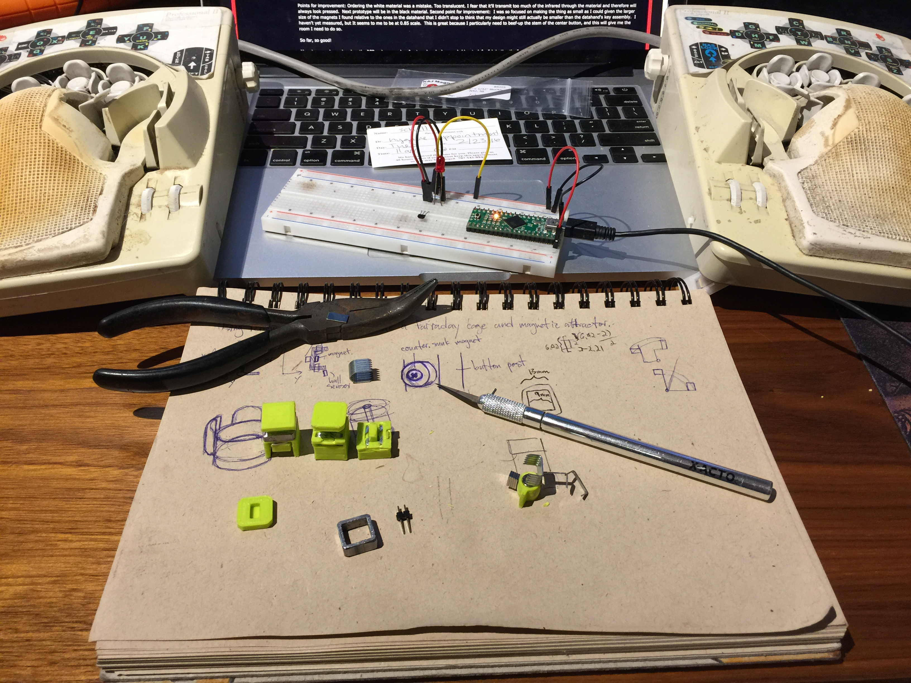

# hardware

## Keyboards
Keyboards are what we use for everything what we do. In order to prevent
injuries it's key that we use the best tools available. Some cool keyboards
are:
- [happy hacking keyboard](https://en.wikipedia.org/wiki/Happy_Hacking_Keyboard)
- [zyghost / data hand keyboard](http://zyghost.com/img/IMG_0675.JPG)
- [kinesis advantage](https://en.wikipedia.org/wiki/Kinesis_(keyboard))

__data hand keyboard__

## Boards
Boards plug into computers and are extensible with sensors and such.
### USB
The [teensy++](http://pjrc.com/store/teensypp.html) board is excellent at what
it does, integrating directly between computer and io signals.
